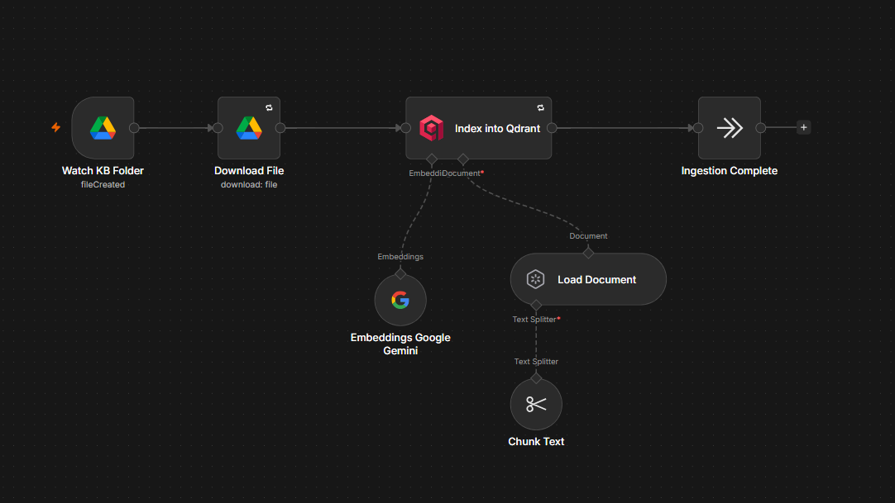
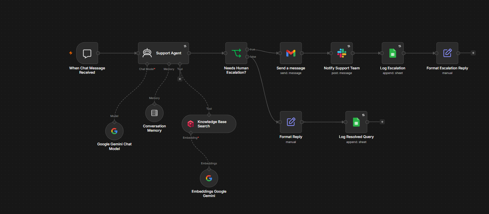
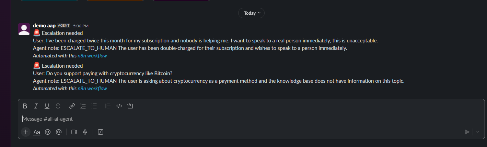
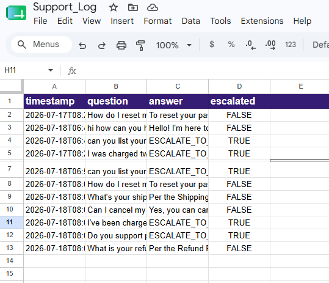

## Screenshots

### Knowledge Base Ingestion

This workflow automatically watches a Google Drive folder, downloads new documents, chunks the content, generates embeddings with Google Gemini, and indexes everything into Qdrant for semantic search.

---

### AI Customer Support Workflow

The main workflow receives customer messages, searches the knowledge base using vector search, generates AI-powered responses, determines whether human escalation is required, and logs every interaction.

---

### Human Escalation Notifications

When the AI cannot confidently answer a customer question or detects a request that requires human intervention, the workflow automatically notifies the support team.

---

### Support Query Logs

Every customer interaction is logged to Google Sheets, including the user's question, AI response, and whether the conversation required escalation.

